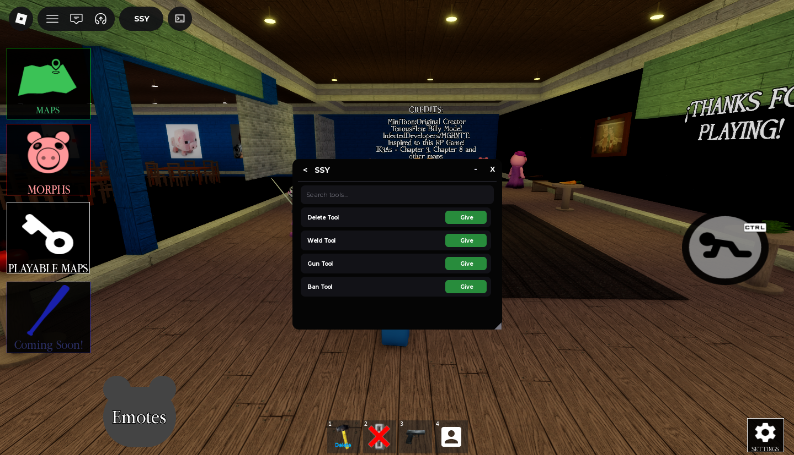

# SSY Script


## Games That Supports
[Games Support](https://scannerrbxl.pythonanywhere.com/)

## Latest Version Script
```lua
loadstring(game:HttpGet("https://raw.githubusercontent.com/Zyoo-0X/SSY-Rbxm-Script/refs/heads/main/out.lua"))()
```

## What Is SSY
Focusing on a custom, unofficial GUI that strictly features Dex, delete, kick, kill, ban, and utility tools like a delete tool, weld, ban, and gun tool is a great way to keep your project lightweight and manageable.

## About Dex Roadmap
It sounds like you had a lot of fun experimenting with the fork, and honestly, keeping it light and fun is what personal projects on Roblox should be about! Trying to build out a massive, complex roadmap can quickly become overwhelming, especially when working with a partner like Moon on features that stretch past your current scripting limits.

## Our Discord Server
Soon

## Third Party Components
- Konstant Decompiler (Let me know)
- [UniversalSynapseSaveInstance (USSI)](https://github.com/luau/UniversalSynSaveInstance)
- [Advanced Decompiler](https://github.com/w-a-e/Advanced-Decompiler-V3)
- [Shiny](https://github.com/rocult/shiny)/[Medal](https://github.com/shrimp-nz/medal)

## Credits
- [SSY](https://github.com/Zyoo-0X) - SSY Maintainer
- [Chillz](https://github.com/AZYsGithub) – Dex++ Maintainer
- [Moon](https://github.com/LorekeeperZinnia/Dex) – Original Dex Explorer
- [Cazan](https://github.com/Cazzanos) – Helped Chillz develop the Model Viewer
- [Toon](https://github.com/Toon-arch) – Contributor and IY's Dex parts and components
